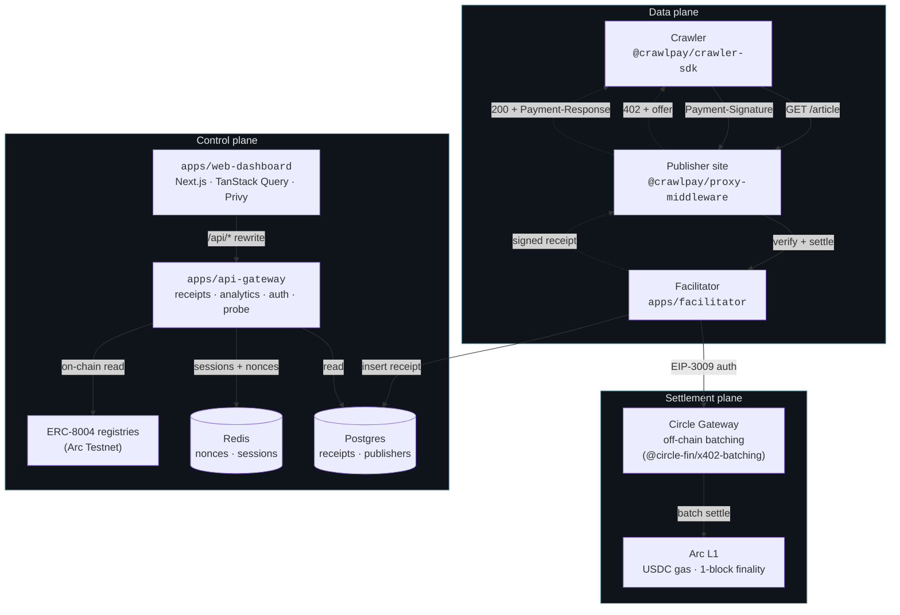
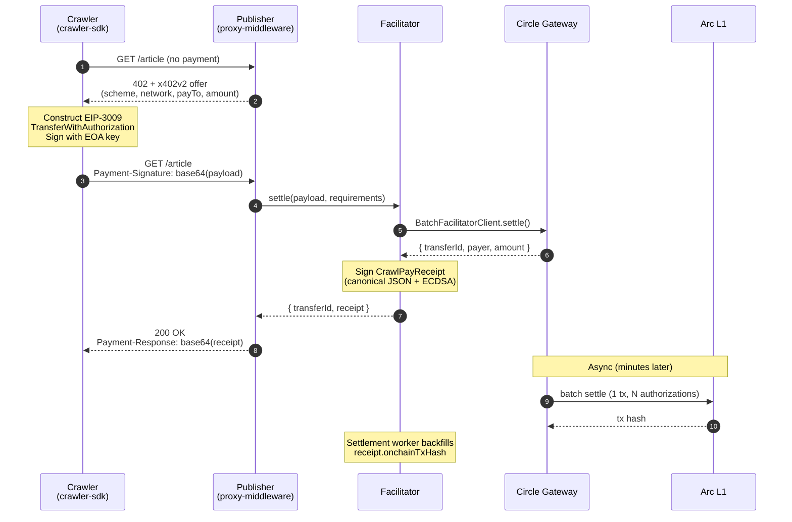

# CrawlPay

[](./LICENSE)
[](https://nodejs.org)
[](https://www.typescriptlang.org)
[](https://pnpm.io)

Open-source pay-per-crawl infrastructure for the open web. Publishers charge AI crawlers per URL fetched in USDC at sub-cent prices; every fetch produces a portable cryptographically-signed receipt. Authorizations are aggregated off-chain by **Circle Gateway** and settled in batches on **Arc L1**.

Built on **x402 v2**, **EIP-3009**, and **ERC-8004**.

## Table of contents

- [Problem and approach](#problem-and-approach)
- [Architecture](#architecture)
- [Protocol flow](#protocol-flow)
- [Receipt model](#receipt-model)
- [Tech stack](#tech-stack)
- [Repository layout](#repository-layout)
- [Getting started](#getting-started)
- [Documentation](#documentation)
- [Roadmap](#roadmap)
- [License](#license)
- [References](#references)

## Problem and approach

The web's economic model assumes humans. Humans browse slowly, click ads occasionally, sometimes subscribe. AI crawlers don't. A single research bot can fetch a million pages a week. At that volume, ad-supported sites are uneconomical (crawlers don't see ads), subscription-only sites are inflexible (they overcharge tiny readers and undercharge industrial bots), and outright blocking leaves money on the table while pushing crawlers to scrape harder. The economically right answer is **per-fetch pricing as small as $0.0001**.

No existing payment rail makes that viable. Stripe's flat $0.30 minimum is a 300,000% fee on a $0.0001 charge. PayPal and Lemon Squeezy are worse. Cloudflare's Pay-Per-Crawl exists but is gated to enterprise customers behind a sales call. The whole long tail of the web — small publishers, indie news sites, niche research databases — has no option.

CrawlPay collapses per-payment cost to near-zero by combining three things:

- **EIP-3009 (`TransferWithAuthorization`)** — the crawler signs an off-chain USDC authorization in a single EIP-712 message. No gas, no transaction submitted, costs literally nothing.
- **Circle Gateway** — aggregates thousands of those authorizations across publishers and crawlers, then settles them in a single batched on-chain transaction every few minutes.
- **Arc L1** — Circle's purpose-built chain where USDC is the native gas token, with sub-second deterministic finality and dollar-denominated fees. No separate gas asset to hold; no probabilistic confirmations to wait on.

The protocol layer is **x402 v2**: a CrawlPay-protected URL returns a standard `402 Payment Required` with a JSON offer when called without payment, and a standard `200 OK` with a signed receipt in the response header when payment is presented. There is no new protocol to learn — anything that doesn't care still sees a URL, a status code, and a body. Crawlers that do care install one SDK and pay transparently.

Every paid fetch produces a **portable, cryptographically signed receipt** that proves payment occurred — verifiable by anyone with the receipt and the facilitator's public key, no access to CrawlPay's database required. Receipts double as audit logs, billing records, and (in v2) as input to a reputation system that lets publishers gate access on crawler payment history.

## Architecture

CrawlPay separates concerns across three planes — **data**, **settlement**, and **control** — so that no single plane's failure modes block the others. The data plane handles HTTP fetches and never blocks on settlement; the settlement plane batches authorizations off-chain and settles asynchronously; the control plane handles dashboards, auth, and on-chain reads, and is read-only relative to the hot path.



**Data plane.** A single paid fetch never blocks on settlement. The crawler's SDK signs an EIP-3009 authorization, the publisher's middleware forwards it to the facilitator, the facilitator gets a synchronous response from Circle Gateway (a transfer UUID — Gateway has accepted the authorization into a batch), then signs and returns the `CrawlPayReceipt` in the response. The crawler has its content. End-to-end latency in the smoke test: **~1970 ms** against real Gateway testnet — dominated by the Gateway round-trip, not the chain.

**Settlement plane.** This is what Circle Gateway provides. Off-chain, Gateway aggregates authorizations from many publishers and many crawlers and settles them all in a single Arc transaction every few minutes. Gas cost amortizes across the entire batch, which is what makes sub-cent pricing economically viable in the first place. The on-chain tx hash backfills into `receipt.onchainTxHash` via a settlement worker (v0.1) once the batch lands — but the receipt itself is final the moment the facilitator signs it. The dashboard's `Verify signature` button doesn't need the on-chain hash to confirm a receipt is valid.

**Control plane.** Read-mostly. The api-gateway serves receipt and analytics queries from Postgres, gates write paths behind SIWE-backed cookie sessions, reads ERC-8004 reputation from the Arc Testnet registries via viem, and runs the integration probe (server-side fetch of a publisher's domain to check the middleware's wired up). Publisher onboarding (`POST /publishers`) is the only write surface, and it's gated on a signed-in session whose address becomes the publisher's settlement wallet — clients can't claim to be wallets they don't control. The api-gateway never touches the hot path; if it's down, fetches and Gateway settlements keep working.

The web dashboard is a Next.js client that talks to the api-gateway via a same-origin `/api/*` rewrite, which keeps the session cookie's `SameSite=Lax` constraint simple. Privy provides embedded wallets for publisher onboarding (social login generates a wallet without a browser extension); after Privy connects, the dashboard runs the SIWE flow to issue a cookie session. The crawler side stays bring-your-own-EOA — crawlers are developers and already manage signing keys.

## Protocol flow

CrawlPay's protocol is **x402 v2**: a publisher's middleware emits a `402 Payment Required` with a JSON offer; the crawler signs an EIP-3009 authorization scoped to that offer; the publisher's middleware forwards the signed payload to Circle Gateway via the facilitator and returns the content with a signed receipt header. The whole sequence is one HTTP round-trip plus an asynchronous settlement that happens later.



### Phase details

**Phase 1 — Discovery.** Crawler sends a plain `GET`. No payment headers. To a browser or anything that doesn't speak x402, this is an ordinary request.

**Phase 2 — Offer.** Middleware classifies the request (User-Agent heuristics, optional IP reputation) and either lets it through (humans free) or returns a 402 with an x402 v2 offer:

```json
{
  "x402Version": 2,
  "accepts": [{
    "scheme": "exact",
    "network": "arcTestnet",
    "maxAmountRequired": "100",
    "payTo": "0xPublisher…",
    "asset": "0x3600000000000000000000000000000000000000",
    "extra": {
      "name": "GatewayWalletBatched",
      "version": "1",
      "crawlpay_publisher_id": "pub_techNotes"
    }
  }]
}
```

`maxAmountRequired` is atomic USDC (6 decimals): `100` = $0.0001. The `extra` block carries the EIP-712 domain hints the crawler needs to sign correctly. The `accepts` array allows multiple schemes per resource; v0 advertises only the Gateway `exact` scheme on Arc.

**Phase 3 — Authorization.** Crawler constructs an [EIP-3009](https://eips.ethereum.org/EIPS/eip-3009) `TransferWithAuthorization` and signs it. Several constraints trip people up — they're all enforced by Circle Gateway:

| Field | Value | Why |
|---|---|---|
| Domain `name` | `GatewayWalletBatched` | Not `USD Coin` — Gateway uses its own EIP-712 domain |
| Domain `version` | `"1"` | Not `"2"` |
| Domain `verifyingContract` | GatewayWallet address (`0x0077777d7EBA4688BDeF3E311b846F25870A19B9` on Arc Testnet) | Not the USDC token address |
| `chainId` | `5042002` (Arc Testnet EVM chain ID) | Not Gateway's domain ID (26) |
| `validBefore` | ≥ 7 days in the future | Gateway testnet enforces `minValiditySeconds = 604800` |
| Signer | **EOA only** | Gateway uses `ecrecover`; ERC-1271 / EIP-6492 signatures are rejected |
| `nonce` | 32 random bytes | Single-use; tracked by USDC contract's `authorizationState` mapping |

The signed payload is base64-JSON and sent in the **`Payment-Signature`** header (the x402 v2 name; not the older `X-PAYMENT`).

**Phase 4 — Verification and settlement.** Middleware forwards to the facilitator. The facilitator uses Circle's `BatchFacilitatorClient.settle()`, which validates the signature, enqueues the authorization into the next batch, and returns a **transfer UUID** synchronously. The transfer UUID is not an Arc tx hash — the actual on-chain hash lands when the batch settles minutes later. Returning synchronously is what makes the data plane fast; the trade-off is that `receipt.onchainTxHash` is empty for a short window after settlement.

**Phase 5 — Delivery.** Middleware returns `200` + the signed `CrawlPayReceipt` in the **`Payment-Response`** header (x402 v2 name; not `X-PAYMENT-RESPONSE`). The crawler verifies the signature locally (it has the facilitator's public key), confirms the URL and amount match what it requested, then uses the body.

## Receipt model

Every paid fetch produces a `CrawlPayReceipt` — portable cryptographic evidence:

```typescript
interface CrawlPayReceipt {
  version: '1';
  publisherId: string;
  publisherWallet: `0x${string}`;
  crawlerWallet: `0x${string}`;
  crawlerAgentId?: string;          // ERC-8004 agent tokenId, if registered
  url: string;
  urlHash: `0x${string}`;           // sha256(url + '\n' + timestamp)
  amount: string;                   // atomic USDC (stringified bigint)
  currency: 'USDC';
  network: 'arcTestnet';
  authorizationNonce: `0x${string}`;
  timestamp: number;                // unix seconds
  facilitatorPubkey: `0x${string}`;
  batchId?: string;                 // Gateway transfer UUID
  onchainTxHash?: `0x${string}`;    // set by the settlement worker after batch lands
  signature: `0x${string}`;         // ECDSA over the canonicalized body
}
```

Receipts sign over a **canonical JSON form** with lexicographic key ordering and stable number serialization. Any field mutation invalidates the signature. The verifier rejects unknown fields, so adding metadata is a versioning event (`version: '2'`) — old receipts stay verifiable forever. Verification is `keccak256(canonicalize(body))` + `ecrecover` against the facilitator's public key; the dashboard's **Verify signature** button does exactly that via `POST /receipts/verify`.

## Tech stack

| Layer | Tools |
|---|---|
| Language | TypeScript 5.4 strict, ES2022 target |
| Runtime | Node 20+ · pnpm 9 workspaces · Turbo |
| Backend HTTP | Fastify 4 (facilitator, api-gateway) |
| Frontend | Next.js 15 (App Router) · React 18 · Tailwind 3.4 · Framer Motion · Recharts |
| State / data | TanStack Query 5 · viem 2 |
| Auth | Privy embedded wallets · `siwe` (EIP-4361) · HTTP-only cookies · `@fastify/cookie` |
| Payments | `@circle-fin/x402-batching` (Circle Gateway client + server SDK) |
| Receipt crypto | viem `signMessage` + canonical JSON; keccak256 over the body |
| Persistence | Postgres 16 (`pg`) · Redis 7 (`ioredis`) |
| On-chain reads | viem `publicClient.readContract` against Arc Testnet ERC-8004 registries |
| Testing | Vitest |

## Repository layout

```
crawlpay/
├── apps/
│   ├── facilitator/           x402 verification · Gateway settle · receipt signing
│   ├── api-gateway/           Receipts · analytics · publishers · SIWE auth · probe · ERC-8004
│   └── web-dashboard/         Landing · onboarding · publisher + crawler dashboards
├── packages/
│   ├── types/                 Shared protocol types (CrawlPayReceipt, AtomicUsdc, …)
│   ├── receipt-signer/        Canonical-JSON sign + verify
│   ├── proxy-middleware/      Drop-in Express middleware for publishers
│   ├── crawler-sdk/           Buyer SDK over Circle's GatewayClient (budgets, retries, cache)
│   └── persistence/           Postgres + Redis + in-memory repos
├── scripts/
│   ├── smoke/                 End-to-end smoke test against real Circle Gateway
│   └── demo/                  60-tx demo session runner
├── infra/                     Docker Compose for Postgres + Redis
└── docs/                      Architecture, protocol, submission docs
```

## Getting started

### Prerequisites

- Node 20+
- pnpm 9
- Docker (for local Postgres + Redis)
- An EOA private key funded with USDC on Arc Testnet — get test USDC from [faucet.circle.com](https://faucet.circle.com) → Arc Testnet

### Setup

```bash
git clone https://github.com/StrimzLab/crawlpay
cd crawlpay
pnpm install

cp .env.example .env
# Fill: PUBLISHER_ADDRESS, CRAWLER_PRIVATE_KEY, CRAWLPAY_RECEIPT_PRIVATE_KEY
# Optional: NEXT_PUBLIC_PRIVY_APP_ID (sign in disabled if absent; everything else works)
```

### Bring up infrastructure

```bash
pnpm infra:up      # Postgres on :5433, Redis on :6380
pnpm migrate       # apply schema
```

### Verify Circle Gateway reachability

```bash
# Terminal A
pnpm smoke:seller

# Terminal B
pnpm smoke:buyer   # deposits 1 USDC into Gateway (one-time) and pays the seller
```

A passing smoke test proves the full Circle Gateway round-trip on Arc Testnet.

### Run the live stack

Each in its own terminal:

```bash
pnpm --filter @crawlpay/facilitator dev   # :3001
pnpm --filter @crawlpay/api-gateway dev   # :8080
pnpm web:dev                              # :3000
```

### Generate demo data

```bash
pnpm demo
```

Boots a local publisher, runs 60 paid crawls through real Circle Gateway, and persists every receipt to Postgres. Visit `http://localhost:3000/publisher/pub_demoTechnotes` to see the populated dashboard.

### Workspace commands

```bash
pnpm typecheck                 # tsc --noEmit across all 11 packages
pnpm test                      # Vitest across packages with tests
pnpm build                     # Turbo-driven build
pnpm infra:up    / infra:down  # Docker Compose for Postgres + Redis
pnpm migrate                   # Apply Postgres schema
```

## Documentation

- [`docs/SUBMISSION.md`](./docs/SUBMISSION.md) — hackathon submission package
- [`docs/video-script.md`](./docs/video-script.md) — demo video script
- [`PRD.md`](./PRD.md) — product requirements doc, long-form architecture and security model
- [`.env.example`](./.env.example) — canonical env var reference

## Roadmap

| Version | Focus | Status |
|---|---|---|
| **v0** (testnet) | Full end-to-end loop on Arc Testnet · Privy onboarding · live dashboards · ERC-8004 reads · 60-tx demo runner | **shipped** |
| v0.1 | Settlement worker that backfills `onchainTxHash` after Gateway batches land | next |
| v0.2 | Per-publisher pricing rules (glob → price) · allow/block lists · webhooks | next |
| v1 | Mainnet on Arc · hosted facilitator with 2.5% fee · Ghost / WordPress plugins | Q3 2026 |
| v2 | ERC-8004 Reputation Registry writes · discovery API · validator network | Q1 2027 |
| v3 | Cross-chain settlement via CCTP · streaming subscriptions · deferred-payment scheme | Q3 2027 |

## License

[Apache License 2.0](./LICENSE). OSI-approved, includes a patent grant.

## References

- [x402 specification](https://x402.org) — HTTP-native payment negotiation
- [Circle Gateway docs](https://developers.circle.com/gateway) — Nanopayments product (off-chain batching, on-chain settle)
- [Arc documentation](https://docs.arc.io) — Arc L1 network, USDC-as-gas, sub-second finality
- [EIP-3009](https://eips.ethereum.org/EIPS/eip-3009) — `TransferWithAuthorization` for gasless USDC
- [EIP-4361](https://eips.ethereum.org/EIPS/eip-4361) — Sign-In with Ethereum (used for dashboard auth)
- [ERC-8004](https://eips.ethereum.org/EIPS/eip-8004) — agent identity + reputation registries
