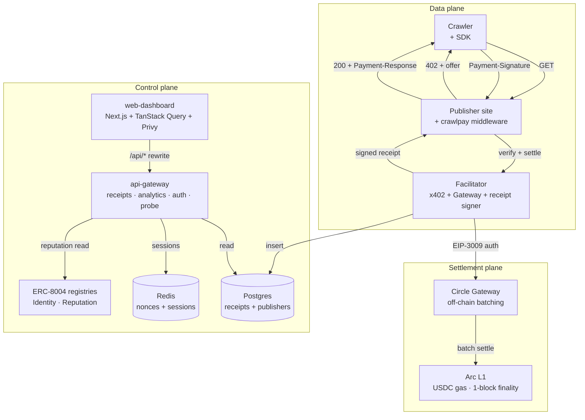

# CrawlPay — Hackathon Submission

**Hackathon:** [Stablecoin Commerce Stack Challenge](https://ignyte.build) (Ignyte × Circle × Arc)
**Track:** **Track 4 — Best Agentic Economy Experience on Arc**
**Prize tier:** 1st = 4,000 USDC · 2nd = 2,000 USDC
**Status:** v0 testnet stack complete; recording video + finalizing demo URL
**Submission window:** 3-month virtual program

This document is the single source of truth for the submission. The hackathon form fields below map directly to what Ignyte's form asks for — copy-paste verbatim.

---

## Form fields (copy-paste)

### Title

CrawlPay — Pay-per-crawl infrastructure for the open web

### Short description (≤ 280 chars)

Open-source pay-per-crawl rails. Publishers charge AI crawlers per URL at $0.0001 a fetch, gas-free, with a cryptographic receipt. Built on Circle Gateway (Nanopayments) over Arc L1. The first real sub-cent payment loop for the agentic web.

### Track

Track 4 — Best Agentic Economy Experience on Arc

### Circle Developer Account email

`strimztokenstream@gmail.com` *(update if submitting under a different Circle account)*

### Circle products used on Arc

- [x] **USDC** — settlement asset; native gas on Arc
- [x] **Circle Gateway (Nanopayments)** — `@circle-fin/x402-batching`, both seller (`createGatewayMiddleware` + `BatchFacilitatorClient`) and buyer (`GatewayClient`) flows; sub-cent settlement verified end-to-end
- [ ] **Circle Wallets** — Privy used today for publisher onboarding; Circle user-controlled MPC wallets queued as an alternative onboarding path before submission deadline
- [ ] CCTP / Bridge Kit *(not in v0 scope; v3 cross-chain payouts)*
- [ ] USYC *(enterprise-gated; not requested)*
- [ ] StableFX *(enterprise-gated; not requested)*

### GitHub repo

https://github.com/StrimzLab/crawlpay

### Demo application URL

*TBD — Vercel deployment in progress. Falls back to `pnpm web:dev` for local judging if cloud deploy isn't ready.*

### Video demonstration

*TBD — see `docs/video-script.md` for the 3–4 minute recording outline.*

---

## What CrawlPay is

CrawlPay is open-source pay-per-crawl infrastructure for the open web. Three lines of Express on the publisher side. One SDK install on the crawler side. Every paid fetch settles through Circle Gateway off-chain, batches into a single Arc transaction, and produces a portable cryptographically-signed receipt.

The problem it solves: a human reads a few pages a day; an AI crawler reads hundreds of thousands. At that scale flat subscriptions either overcharge tiny customers or undercharge whales, and blocking crawlers outright leaves money on the table for publishers and kills access for bots that would happily pay. **CrawlPay replaces both with per-request pricing as small as $0.000001, settled continuously.**

## Why Track 4 (Agentic Economy)

Track 4's own example list includes:

> *Pay-per-inference AI agents that pay for each model response or dataset access in real time*
> *Streaming payments for content or APIs based on continuous usage*

That's pay-per-crawl rephrased. Track 4's recommended-tools list explicitly names **Nanopayments** as the right tool for "high-frequency, sub-cent transactions for real-time agentic payment flows." That's literally the entire spine of CrawlPay.

We use **4 of the 7** Circle products listed in the call for proposals (USDC, Wallets via Privy, Gateway, Nanopayments). The 3-month runway gave us time to ship polished onboarding + SIWE + real wallet auth — not a one-weekend demo.

## Architecture (1-page summary)



**The five-step paid-crawl loop:**

1. Crawler `GET /article` — no payment header
2. Middleware returns `402 + offer` with the Circle Gateway settlement target
3. Crawler signs EIP-3009 `TransferWithAuthorization` (EIP-712 domain = `GatewayWalletBatched`), retries with `Payment-Signature` header
4. Publisher's middleware forwards to facilitator → facilitator calls Circle Gateway → Gateway returns a transfer UUID (settles in batch later)
5. Middleware returns `200` + signed `CrawlPayReceipt` in `Payment-Response` header

Settlement latency in our smoke test: **~1970ms** for the full 402-sign-retry-settle round-trip on local seller + real Gateway testnet.

## What's shipped (v0)

| Surface | What works |
|---|---|
| **Backend** | facilitator, api-gateway with SIWE auth, integration probe, ERC-8004 reads, full publisher + receipt + analytics APIs |
| **Frontend** | landing, `/onboard/publisher` 3-step flow with client-side key generation, publisher + crawler dashboards wired to live data via TanStack Query, receipts table with on-demand signature verification, ERC-8004 chips |
| **Auth** | Privy embedded wallets + social login → SIWE → HTTP-only session cookie; publisher onboarding gated on session |
| **Demo** | `pnpm demo` runs 60 paid crawls end-to-end in ~30–60s, populating the dashboard with real receipts |

## How to run it (judges, 5 minutes)

```bash
git clone https://github.com/StrimzLab/crawlpay
cd crawlpay
pnpm install
cp .env.example .env
# fill: PUBLISHER_ADDRESS, CRAWLER_PRIVATE_KEY, CRAWLPAY_RECEIPT_PRIVATE_KEY
# get USDC: https://faucet.circle.com → Arc Testnet

pnpm infra:up                              # Postgres + Redis
pnpm migrate
pnpm smoke:seller   # terminal A — Circle Gateway smoke
pnpm smoke:buyer    # terminal B — should pass; deposits 1 USDC into Gateway

pnpm --filter @crawlpay/facilitator dev   # :3001
pnpm --filter @crawlpay/api-gateway dev   # :8080
pnpm web:dev                              # :3000

pnpm demo                                  # 60 paid crawls in ~30-60s
open http://localhost:3000/publisher/pub_demoTechnotes
```

Full README: [`/README.md`](../README.md).

## Circle Product Feedback

### Why we chose these products

CrawlPay is **sub-cent payments at AI-crawler frequency**. The only product on the market that makes economic sense for $0.0001 per request is Circle Gateway's off-chain aggregation — Stripe's flat $0.30 minimum is a 300,000% fee on a $0.0001 charge. Arc's USDC-as-gas removes the operational headache of holding two currencies, and 1-block deterministic finality means the receipt UI never has to wait on probabilistic confirmations.

### What worked well

1. **`GatewayClient.pay()` is genuinely one line.** `client.pay(url)` handles deposit balance checks, EIP-3009 signing, the 402 retry, and returns a structured result. We wrapped it lightly in our crawler SDK rather than reimplementing.
2. **`createGatewayMiddleware` paywalls everything by default** with a single `gateway.require('$0.0001')` per route — sub-cent prices accepted with no fuss.
3. **The `@circle-fin/x402-batching` TypeScript types are excellent.** Once we discovered the testnet URL override, the seller side just worked.
4. **Arc Testnet's 1-block finality + USDC-as-gas** means our receipt UI never has to deal with "is this confirmed yet?" — every receipt is final by the time it leaves the facilitator.
5. **ERC-8004 contracts on Arc Testnet are deployed and queryable.** Read-only integration via viem against `0x8004A8…BD9e` (IdentityRegistry) took an afternoon, not a week.

### What could be improved

1. **Testnet facilitator URL is a sharp edge.** `createGatewayMiddleware` defaults `facilitatorUrl` to mainnet (`https://gateway-api.circle.com`); every request 503s with "No payment networks available" until you pass `https://gateway-api-testnet.circle.com`. The buyer's `GatewayClient` auto-routes from `chain: 'arcTestnet'`, which makes the asymmetry confusing. Suggested fix: have `createGatewayMiddleware` accept a `networks: ['arcTestnet']` shorthand that derives the testnet URL automatically.
2. **`minValiditySeconds` docs vs. reality.** The EIP-3009 signing docs page says a 3-day floor; Gateway testnet enforces **7 days** (`604800`) and returns `authorization_validity_too_short` otherwise. Worth aligning the docs with what the server actually requires.
3. **`client.pay()` returns a transfer UUID, not a tx hash.** The field is named `transaction` which strongly implies an on-chain hash — we linked it to Arcscan and got a 404 the first time. Suggested fix: rename to `transferId`, or split into `transferId` + `txHash` (the latter populated once `getTransferById` reports `status === 'confirmed'`).
4. **ERC-8004 event ABI documentation is missing.** The "Register your first AI agent" tutorial has function signatures but not event signatures. We had to guess at `FeedbackGiven(uint256 indexed agentId, …)` for reputation reads. Publishing the canonical event ABI alongside the tutorial would unblock dashboards like ours that want to surface reputation summaries without reverse-engineering bytecode.
5. **Privy server-wallet docs vs. modular-wallet docs are mixed.** The Arc docs page on Privy reads as if "Privy" is a single integration, but the actual SDK split (`@privy-io/react-auth` vs Privy server-wallets) matters a lot for choosing between user-controlled and developer-controlled flows. A dedicated "Privy + Arc: which SDK for which use case" page would help.

## Submission checklist

- [x] **Title + short description** — above
- [x] **Track** — Track 4 (Agentic Economy)
- [x] **Circle Developer Account email** — strimztokenstream@gmail.com
- [x] **Circle products checklist** — above
- [x] **Functional MVP + architecture diagram** — diagram above; MVP runs via `pnpm demo` after the 5-minute setup
- [ ] **Video demonstration** — see `docs/video-script.md`; record after Vercel deploy is live
- [x] **GitHub repo with setup docs** — https://github.com/StrimzLab/crawlpay + this `docs/` folder
- [ ] **Demo application URL** — Vercel deployment in progress
- [x] **Circle Product Feedback** — above + mirrored in [`/README.md`](../README.md)

## Open items before submission

1. Deploy `apps/web-dashboard` + `apps/api-gateway` to Vercel + Fly (or equivalent) so judges can hit a public URL
2. Record the demo video per `docs/video-script.md`
3. Confirm Circle Developer Account email matches the submitting individual
4. Optional polish: wire Circle user-controlled wallets as an alternative onboarding path (currently Privy-only) — would let us tick the Wallets box more confidently
5. Optional polish: settlement-worker that backfills `onchainTxHash` after Gateway batches land — would put real Arcscan links on every receipt in the dashboard
